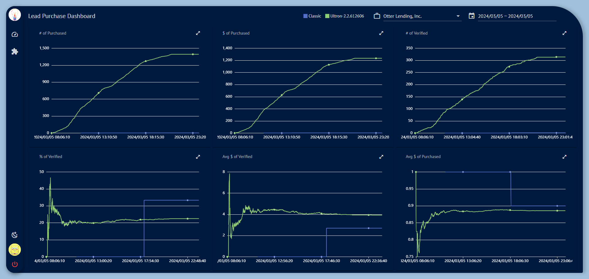
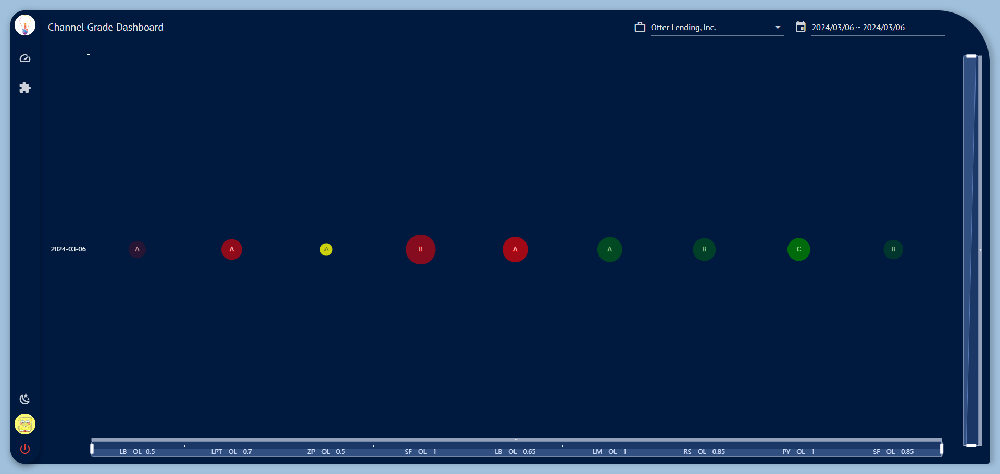
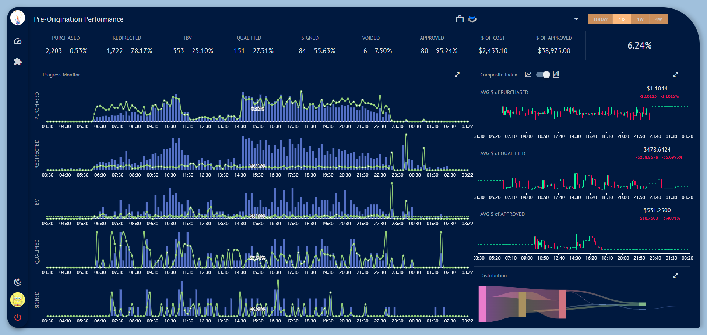
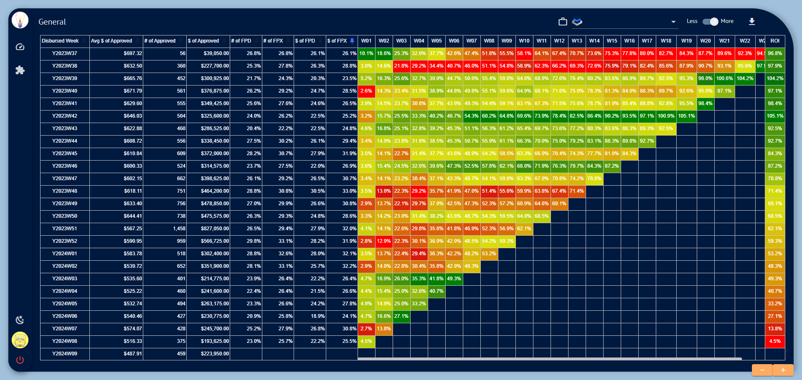

#### 数据仓库领域的经典著作《维度建模工具箱》中，Kimball 定义了经典的维度建模的四步曲，：选定业务过程、声明粒度、确定维度、构建事实。

DWD层实体类定义：  purchased_lead_details（可以通过lead_info中的数据生成该表）

|    字段名    |  类型   |                   注释                    |
| :----------: | :-----: | :---------------------------------------: |
|      id      | bigint  |                                           |
|   lead_id    | bigint  |                                           |
|  channel_id  | bigint  |                                           |
|    price     | decimal |              lead购买的价格               |
|    status    | integer |      1表示购买的，10表示ibv验证后的       |
| portfolio_id | bigint  |                                           |
|  created_at  | bigint  |              lead的创建时间               |
| purchased_at | bigint  |             lead被购买的时间              |
| purchased_by | integer |         1表示classic，2表示ultron         |
|  updated_at  | bigint  | 记录被更新的时间，目前只有ibv验证时会更新 |
|    aff_id    | varchar |                                           |
|    sub_id    | varchar |                                           |
|    state     | varchar |                                           |

DWD层实体类定义：loan_details

|        字段名         |  类型   |              注释              |
| :-------------------: | :-----: | :----------------------------: |
|          id           | bigint  |                                |
|        loan_no        | string  |                                |
|        lead_id        | bigint  |                                |
|     portfolio_id      | bigint  |                                |
|   approvedPrincipal   | decimal |      可以在loan表里面获得      |
|  qualifiedPrincipal   | decimal |         loan表里面获得         |
|      created_at       | bigint  | 可以在event表里面获得（10001） |
|     submitted_at      | bigint  |                                |
|      approved_at      | bigint  | 可以在event表里面获得（10013） |
|     redirected_at     | bigint  |          目前获取不到          |
|      verified_at      | bigint  | 可以在event表里面获得（10004） |
|     qualified_at      | bigint  | 可以在event表里面获得（10005） |
|     credit_amount     | decimal | 和上面的qualifiedPrincipal一样 |
|       signed_at       | bigint  | 可以在event表里面获得（10010） |
|    approved_amount    | decimal | 和上面的approvedPrincipal一样  |
|        void_at        | bigint  | 可以在event表里面获得（10017） |
|  current_loan_status  |         |                                |
|  first_payment_debit  |         |                                |
| amount_algorithm_type |         |                                |

DWD层实体类定义：pay_installment(可以通过Veronica installment表中获取数据)

|       字段名       |  类型   |                注释                 |
| :----------------: | :-----: | :---------------------------------: |
|         id         | bigint  |                                     |
|      loan_id       | bigint  |                                     |
|   installment_id   | bigint  | 目前installment表中没有（不是必须） |
|  transaction_type  |   int   |                                     |
| transaction_status |   int   |                                     |
|  transaction_mode  |   int   |                                     |
|  transaction_date  | bigint  |                                     |
|       amount       | decimal |                                     |
|    change_type     |   int   |       目前installment表中没有       |

一. Lead Purchased DashBoard

DWS层实体类定义： lead_purchase_monitor （用于存储统计结果，可使用purchased_lead_datails表的数据进行统计）              

|      字段名      |  类型   |      注释      |
| :--------------: | :-----: | :------------: |
|        id        | bigint  |                |
|   portfolio_id   | bigint  |                |
|    created_at    | bigint  | 每十秒一个刻度 |
|   engine_type    |   int   |                |
|  engine_version  | string  |                |
|  purchased_num   |   int   |                |
| purchased_amount | decimal |                |
|   verified_num   |   int   |                |

二. Channel Grade DashBoard界面

DWS层实体类定义：channel_grade_dashboard（该表可根据purchased_lead_details的数据生成，但是要保证实时性）

|       字段名        |  类型   |                    注释                     |
| :-----------------: | :-----: | :-----------------------------------------: |
|         id          | bigint  |                                             |
|    portfolio_id     | bigint  |                                             |
|     channel_id      | bigint  |                                             |
|     created_at      | bigint  |                 刻度为一天                  |
|  rate_of_verified   | decimal | lead验证率（验证的lead数量/购买的lead数量） |
| number_of_purchased |   int   |                 lead购买量                  |
|    channel_grade    | string  |            可根据channel_id关联             |

三. Pre-Origination Performance界面

DWS层实体类定义：aggregate_lead_snapshot （可以根据loan_details表的数据进行统计）

|       字段名        |  类型   |    注释    |
| :-----------------: | :-----: | :--------: |
|         id          | bigint  |            |
|    portfolio_id     | bigint  |            |
|     created_at      | bigint  | 刻度为一天 |
|      purchased      |   int   |            |
|     redirected      |   int   |            |
|         ibv         |   int   |            |
|      qualified      |   int   |            |
|       signed        |   int   |            |
| amount_of_purchased | decimal |            |
| amount_of_qualified | decimal |            |
| amount_of_approved  | decimal |            |
|  amount_of_voided   | decimal |            |
|       voided        |   int   |            |
|      approved       |   int   |            |
|     total_lead      |   int   |            |

DWS层实体类定义：lead_distribution (当loan的status或sub_status发生变化时都需要存记录)

|     字段名      |  类型  |       注释        |
| :-------------: | :----: | :---------------: |
|       id        | bigint |                   |
|     lead_id     | bigint |                   |
|     loan_id     | bigint |                   |
|  portfolio_id   | bigint |                   |
|   created_at    | bigint |  状态改变的时间   |
|   loan_status   |  int   | 目前event表中没有 |
| sub_loan_status |  int   | 目前event表中没有 |

DWS层实体类定义：candlestick_charts(可以根据aggregate_lead_snapshot表的数据生成)

|    字段名    |  类型   | 注释 |
| :----------: | :-----: | :--: |
|      id      | bigint  |      |
| aggregate_id | bigint  |      |
|     type     |   int   |      |
|   opening    | decimal |      |
|   closing    | decimal |      |
|    lowest    | decimal |      |
|   highest    | decimal |      |

四 .Static Pool界面

DWS层实体类定义：repaymen_of_week(可以根据pay_installment表的数据生成)

|        字段名         | 类型 | 注释 |
| :-------------------: | :--: | :--: |
|          id           |      |      |
|     portfolio_id      |      |      |
|  create_at_of_credit  |      |      |
|    avg_of_approved    |      |      |
|  number_of_approved   |      |      |
|  amount_of_approved   |      |      |
|     number_of_fpd     |      |      |
|     number_of_fpx     |      |      |
|     amount_of_fpd     |      |      |
|     amount_of_fpx     |      |      |
| number_of_transaction |      |      |
| amount_of_transaction |      |      |
|     interest_rate     |      |      |
|       week_size       |      |      |
|      amount_list      |      |      |

